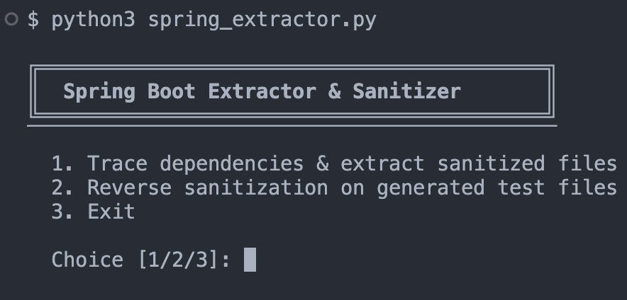

# Code Desensitizer for Airgap environments



## Problem Statement

There could be poor performance when generating test cases on-premise due to existing infrastructure’s performance. This could be due to model choice, lack of GPUs, etc.

## Solution

We can utilize online AI coding assistants or agents to generate the test cases instead of relying on the on-premise's coding assistance which may not have good performance.

***This is tested on Spring Boot Java applications, but the general approach can be adapted to other languages and frameworks as well.***

## Workflow

1. Desensitize relevant on-premise source code with a custom on-premise script
2. Bring out desensitized source code to internet
3. Use online AI coding assistants/agents to generate test cases
4. Bring generated test back into airgap env
5. Run reverse sanitization script

## Requirements

- Python 3.7 or newer
- No third-party packages are required

## Usage

The script supports an interactive menu and two CLI subcommands:

```bash
# Interactive mode
python spring_extractor.py

# CLI subcommands
python spring_extractor.py trace --entry path/to/MyService.java --base com.mycompany --src src/main/java --out ./extracted
python spring_extractor.py reverse --mapping ./extracted/mapping.json --dir ./generated-tests
```

### 1. Interactive mode

Run the script without arguments:

```bash
python spring_extractor.py
```

Then choose one of the following:

- `1` to trace dependencies and extract sanitized source files
- `2` to reverse sanitization on generated test files
- `3` to exit

### 2. Trace and extract

Use the `trace` command to collect the entry class and its internal Spring Boot dependencies, sanitize the source, and write the extracted files to an output directory.

```bash
python spring_extractor.py trace \
	--entry src/main/java/com/myco/OrderService.java \
	--base com.myco \
	--src src/main/java \
	--out ./extracted \
	--mapping mapping.json
```

Arguments:

- `--entry`: Path to the entry `.java` file
- `--base`: Base package to trace within
- `--src`: Source root directory, defaulting to `src/main/java`
- `--out`: Output directory for sanitized files, defaulting to `./extracted`
- `--mapping`: Optional `mapping.json` file to reuse existing package and variable mappings
- `--keep-comments`: Keep comments instead of stripping them
- `--strip-javadoc`: Remove `@author` and `@since` Javadoc tags
- `--mask-strings`: Replace string literals with placeholders
- `--strip-loggers`: Remove logger statements

The trace step writes these artifacts into the output directory:

- Sanitized `.java` files
- `mapping.json`
- `CLAUDE_PROMPT.txt`
- `reverse_sanitize.sh`
- `reverse_sanitize.ps1`

### 3. Generate tests externally

Copy the extracted sanitized source files and the generated `CLAUDE_PROMPT.txt` into your online coding assistant or agent of choice. Ask it to generate JUnit 5 tests using Mockito and AssertJ.

### 4. Reverse sanitization

After you bring the generated tests back into the airgap environment, use the `reverse` command to restore the original package and variable names:

```bash
python spring_extractor.py reverse \
	--mapping ./extracted/mapping.json \
	--dir ./generated-tests
```

Arguments:

- `--mapping`: Path to the saved `mapping.json`
- `--dir`: Directory containing the generated `.java` test files

## Workflow Summary

1. Run `trace` to extract and sanitize the relevant source code.
2. Send the sanitized source and prompt file to an online AI assistant.
3. Save the generated tests in a local directory.
4. Run `reverse` to restore the original names in the generated tests.

## Notes

- The extractor traces imports that stay within the provided base package.
- Package mappings and variable/class mappings are both preserved in `mapping.json` so the reverse step can restore them.
- If a source file cannot be located automatically, the script reports it during extraction.


